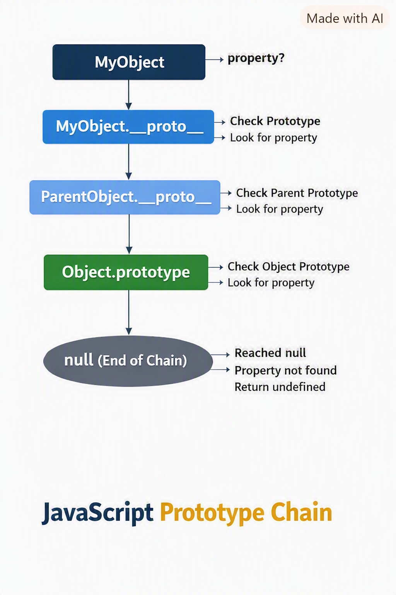

# core-js

Javascript

### Question List

1. [What are the differences between `var`, `let`, and `const`?](#q1)
2. [What does `this` refer to in JavaScript?](#q2)
3. [What is closure and how is it used?](#q3)
4. [Explain the event loop and call stack.](#q4)
5. [What is the difference between `==` and `===`?](#q5)
6. [What are prototypes and prototype inheritance?](#q6)
7. [What are async/await and Promises?](#q7)
8. [Execution Contexts in JavaScript?](#q8)
9. [What is the difference between `null` and `undefined` and `not defined`?](#q9)
10. [What is event delegation?](#q10)
11. [How do you clone an object in JavaScript?](#q11)
12. [What is a JavaScript module and how do `CommonJS` and `ES Modules` differ?](#q12)
13. [What are `call`, `apply`, and `bind`?](#q13)
14. [What is the difference between `map`, `filter`, and `reduce`?](#q14)
15. [What is a pure function?](#q15)
16. [What is the shortest program in JS?](#q16)
17. [How do memory leaks happen in JS and how to detect/avoid them?](#q17)
18. [Deep dive: microtasks, macrotasks and rendering steps](#q18)
19. [How JavaScript engines optimize code (hidden classes, inline caches)?](#q19)
20. [How V8 garbage collection and memory management work?](#q20)
21. [Module loading and circular dependencies (CJS vs ESM)](#q21)
22. [Immutability patterns and structural sharing](#q22)
23. [Scope and Scope Chain](#q23)
24. [Security in browser JS: XSS, CSP and safe DOM updates](#q24)
25. [Concurrency in the browser: Web Workers and SharedArrayBuffer](#q25)
26. [Block Scope and Shadowing in JS](#q26)
27. [What is sparse array and how in built methods behave?](#q27)
28. [Debouncing and Throttling](#q28)
29. [Currying in JS](#q29)
30. [Call, Apply and Bind](#q30)
31. [Recursion](#q31)
32. [What are `Set` and `Map`, and how do you use and iterate through them?](#q32)
33. [What are `WeakSet` and `WeakMap`, and how do you use them?](#q33)
34. [How are `Set`, `Map`, `WeakSet`, and `WeakMap` different?](#q34)
35. [When should you use each collection?](#q35)
36. [What are the commonly used JavaScript array methods?](#q36)
37. [What are the commonly used JavaScript string methods?](#q37)
38. [What loops are available in JavaScript and how are they different?](#q38)

---

## Answers

<a id="q1"></a>

### 1. What are the differences between `var`, `let`, and `const`?

- `var` is function-scoped, can be redeclared, and is hoisted with an initial value of `undefined`.
- `let` and `const` are block-scoped, not redeclarable in the same scope, and are hoisted into a temporal dead zone until initialization.
- `const` creates a constant reference and must be initialized at declaration.

- `Temporal Dead Zone (TDZ)` It is the time between the creation of a variable and its initialization. During this time, the variable is in a "dead" state, and it cannot be accessed. If you try to access a variable in the TDZ, you will get a ReferenceError

[Back to question list](#question-list)

<a id="q2"></a>

### 2. What does `this` refer to in JavaScript?

- In a regular function, `this` refers to the calling context.
- In a method, `this` refers to the object owning the method.
- In a constructor, `this` refers to the newly created instance.
- In arrow functions, `this` is lexically inherited from the surrounding scope.

[Back to question list](#question-list)

<a id="q3"></a>

### 3. What is closure and how is it used?

- Closure is the combination of a function bundled together with references to its surrounding state (the lexical environment).
- In other words, a closure gives you access to an outer function’s scope from an inner function.
- In javascript closures are created every time a function is created.
- Common uses include data privacy, factory functions, and maintaining state between function calls.
- Uses of closures:
  - Module Design Pattern: Closures are used to create private variables and methods in JavaScript. By using closures, we can create a module that encapsulates its data and exposes only the necessary methods to interact with that data.
    ````Ex:
        function createCounter() {
            let count = 0;
            return {
                increment() {
                    count++;
                    return count;
                },
                decrement() {
                    count--;
                    return count;
                }
            };
        }```

    ````
  - Currying: Closures are used to implement currying in JavaScript. Currying is a technique of transforming a function that takes multiple arguments into a sequence of functions that take a single argument.
  - Function like once: Closures can be used to create functions that can only be called once. This is useful for creating functions that perform a specific task and should not be called again.
    ````Ex:
        function once(fn) {
            let called = false;
            return function(...args) {
                if (!called) {
                    called = true;
                    return fn(...args);
                }
            };
        }```

    ````
  - memoization: Closures can be used to implement memoization in JavaScript. Memoization is a technique of caching the results of expensive function calls and returning the cached result when the same inputs occur again.
  - Maintaining state in async world: Closures can be used to maintain state in asynchronous operations, ensuring that variables retain their values across async boundaries.
  - setTimeout and setInterval: Closures are used in setTimeout and setInterval functions to maintain the state of variables between function calls. This allows us to create timers and intervals that can access variables defined in their outer scope.
  - Iterators: Closures are used to create iterators in JavaScript. An iterator is an object that allows us to traverse through a collection of data, such as an array or a linked list. By using closures, we can create iterators that maintain their state between function calls.
    ````Ex:
        function createIterator(items) {
            let index = 0;
            return {
                next() {
                    if (index < items.length) {
                        return { value: items[index++], done: false };
                    } else {
                        return { value: undefined, done: true };
                    }
                }
            };
        }```

    ````
  - Disadvantages of closures:
    - Memory consumption: Closures can lead to increased memory consumption, as they keep references to their outer scope variables even after the outer function has finished executing. This can prevent garbage collection from freeing up memory, leading to potential memory leaks.

  #### 3.1. What is `Smartly garbage collection`?

        - JS engine checks if any variable in the outer scope is being referenced by the inner function. If it is, then it will not be garbage collected. If it is not, then it will be garbage collected.

[Back to question list](#question-list)

<a id="q4"></a>

### 4. Explain the event loop and call stack.

- `Call Stack:` In JavaScript, the call stack is where functions are executed one at a time in order.
- `Stack:` A Last-In, First-Out (LIFO) data structure that tracks function execution.
- `Event Loop:` A runtime mechanism that continuously checks if the call stack is empty and then processes tasks from queues.
  - Event loop acts as gateway between the call stack and the callback/microtask queue. It continuously checks the call stack and the `callback`/`microtask queue`, and if the call stack is empty, it takes the first callback from the queue and pushes it onto the call stack for execution.

  - `microtask queue` has higher priority than the `callback queue`. This means that if there are any microtasks in the queue, they will be executed before any callbacks in the callback queue.

  - promise callbacks and mutation observers are added to the microtask queue, while setTimeout and setInterval callbacks are added to the callback queue. This means that promise callbacks will be executed before any setTimeout or setInterval callbacks, even if they were scheduled to run later.

  - `starvation of callback queue:` If the microtask queue is continuously filled with new tasks, the callback queue may never get a chance to execute. This can lead to starvation of the callback queue, where callbacks are delayed indefinitely. To avoid this, it is important to ensure that microtasks are not continuously added to the queue without allowing the callback queue to execute.

[Back to question list](#question-list)

<a id="q5"></a>

### 5. What is the difference between `==` and `===`?

- `==` performs type coercion before comparison. ( )
- `===` performs strict equality without type conversion.

  ```
  "4" == 4 // gives true (JavaScript applies coercion rules.)
  "4" === 4 // gives false, as it checks bot value and type
  ```

  #### Coercion rules:

        - String vs Number with == → String is converted to Number.
        - Boolean vs Number with == → Boolean is converted to Number (true → 1, false → 0).
        - Null vs Undefined with == → They are equal to each other, but not to anything else.

  #### 5.1. What is Type coercion?

        - Type coercion in JavaScript is the process of automatically or implicitly converting values from one data type to another.
        - Since JavaScript is loosely typed, it tries to "guess" what type you mean when performing operations.
        - `Explicit Coercion` (done manually by developer)

  ```
  // Implicit Coercion
  console.log("5" + 1);   // "51" → number 1 coerced to string
  console.log("5" - 1);   // 4   → string "5" coerced to number
  console.log(true + 1);  // 2   → true coerced to number (1)

  Common Coercion Rules
      String + Number → String
      String - Number → Number (-, *, /, <, >)
      Boolean → Number
      Null → Number (0)
      Undefined → Number (NaN)

  // Explicit Coercion
  Number("42");   // 42
  String(42);     // "42"
  Boolean(0);     // false
  ```

[Back to question list](#question-list)

<a id="q6"></a>

### 6. What are prototypes and prototype inheritance?

- In JavaScript, prototypes are special objects that provide a way for objects to inherit properties and methods
- `prototype inheritance` is the mechanism where one object can access features defined in another object via the `prototype chain`.
- For a method/variable, JavaScript first looks in the object itself. If not found, it looks in the prototype. If not prototype's prototype and the chain continues.
- The chain ends till it find the desired variable or at Object.prototype, whose prototype is null.

  ```
  const obj = { name: "Vaseem" };
  console.log(obj.toString());
  // Works even though `toString` is not defined in obj
  // It comes from Object.prototype


  const parent = { greet: () => "Hello!" };
  const child = Object.create(parent);

  console.log(child.greet()); // "Hello!" (inherited from parent)


  function Person(name) {
  this.name = name;
  }

  Person.prototype.sayHi = function() {
  console.log(`Hi, I'm ${this.name}`);
  };

  const user = new Person("Vaseem");
  user.sayHi(); // "Hi, I'm Vaseem"

  ```

  

#### 6.1.1 What is Prototype?

- A prototype is an object that JavaScript uses for `inheritance`. Objects can delegate property and method lookups to their prototype through the internal [[Prototype]] chain. This allows multiple objects to share methods instead of creating separate copies for every object.

#### 6.1.2 Difference between prototype, **proto**, and [[Prototype]] ?

- prototype is a property of constructor functions and is used as the prototype for objects created with new. [[Prototype]] is the internal prototype reference of an object. **proto** is a legacy accessor that exposes that internal prototype. Object.getPrototypeOf() is preferred over **proto**.

  ```
      Constructor function
          │
          │ .prototype
          ↓
      Prototype object
          ↑
          │ [[Prototype]]
          │
      object
          │
          └── exposed through __proto__
  ```

- `prototype` is a property of constructor functions.

  ```
  function Person() {}
  console.log(Person.prototype);

  // Person.prototype is the object that will become the prototype of objects created using: new Person()
  Ex:
      function Person(name) {
          this.name = name;
      }

      Person.prototype.sayHello = function () {
          console.log("Hello");
      };

      const p = new Person("John");

      Object.getPrototypeOf(p) === Person.prototype; // true

  ```

- `__proto__` is an accessor that exposes an object's internal [[Prototype]]

  ```
  const obj = {};
  console.log(obj.__proto__ === Object.prototype); // true

  // better to use Object.getProtottypeOf(obj) instead of obj.__proto__
  ```

- `[[Prototype]]` is the internal specification-level property.

  ```
  // You normally cannot directly access it using:
  obj.[[Prototype]] // ❌

  //Instead:
  Object.getPrototypeOf(obj);

  // You can change it
  Object.setPrototypeOf(obj, anotherObject);
  ```

#### 6.1.3 How does the new keyword work internally?

- The new operator creates a new object, sets its internal [[Prototype]] to the constructor's prototype, calls the constructor with the new object as this, and returns the resulting object unless the constructor explicitly returns another object.

  ```
  function Person(name) {
      this.name = name;
  }

  Person.prototype.sayHello = function () {
      console.log(`Hello ${this.name}`);
  };

  const person = new Person("John");

  // Internally what does new do ?
      const obj = {};
      obj.__proto__ = Person.prototype;
      User.call(obj, "Jon");

      return obj;
  ```

#### 6.1.4 Why add methods to Constructor.prototype instead of inside the constructor?

- Methods placed inside the constructor are recreated for every instance. Methods placed on the constructor's prototype are created once and shared by all instances, which generally reduces memory usage and avoids unnecessary function allocations.

  ```
  // Approach 1: Methods inside the constructor
      function Person(name) {
          this.name = name;

          this.sayHello = function () {
              console.log("Hello");
          };
      }

      const p1 = new Person("John");
      const p2 = new Person("David");

      // Every time you create an obj, a new function obj is created
      p1.sayHello !== p2.sayHello;

  // Approach 2: Methods on the constructors prototype
      function Person(name) {
          this.name = name;

      }
      Person.prototype.sayHello = function () {
              console.log("Hello");
        };

      const p1 = new Person("John");
      const p2 = new Person("David");

      p1.sayHello === p2.sayHello;

      // Both objects share the same function.
        p1 ──┐
             ├──> Person.prototype.sayHello
        p2 ──┘
  
  // Modern Approach2, using classes
    class Person {
        constructor(name) {
            this.name = name;
        }

        sayHello() {
            console.log("Hello");
        }
    }
  ```

#### 6.1.5 What is Object.create() and how does it implement prototype-based inheritance?
- Object.create() creates an object whose [[Prototype]] is the object passed to it. It provides a direct way to implement prototype-based inheritance without using a constructor or new.
    ```
    const animal = {
        eat() {
            console.log("Eating");
        }
    };

    const dog = Object.create(animal);

    dog.bark = function () {
        console.log("Barking");
    };

    dog.eat();
    dog.bark();

    // JavaScript doesn't find eat directly on dog. It finds it on animal.
    Object.getPrototypeOf(dog) === animal; // true
    ```

- If JavaScript has classes, why do we need prototypes?"
    - JavaScript classes are syntactic sugar over the prototype-based inheritance mechanism.

#### 6.1.8 Classes and Prototypes

- ES6 class syntax is syntactic sugar over prototypes. Under the hood, classes still use prototype inheritance.

  ```
  class Animal {
    speak() { console.log("Generic sound"); }
  }

  class Dog extends Animal {
    speak() { console.log("Woof!"); }
  }

  const d = new Dog();
  d.speak(); // "Woof!"

  ```

- Here, Dog inherits from Animal via the prototype chain.

[Back to question list](#question-list)

<a id="q7"></a>

### 7. What are async/await and Promises?

- In JavaScript, `Promises` and `async/await` are tools for handling asynchronous operations — tasks that take time (like fetching data or reading files) — without blocking the main thread. They make async code readable and predictable.
- Promise:
  - A Promise is an object that represents the eventual completion (or failure) of an asynchronous operation and its resulting value. It allows you to write asynchronous code in a more synchronous manner, making it easier to read and understand.
  - A Promise can be in one of three states:
    - Pending: The initial state of a Promise, before it has been resolved or rejected.
    - Fulfilled: The state of a Promise when the asynchronous operation has completed successfully and a value is available.
    - Rejected: The state of a Promise when the asynchronous operation has failed and an error is available.
  - A Promise is created using the Promise constructor, which takes a single argument: a function that takes two parameters, resolve and reject. The resolve function is called when the asynchronous operation is successful, and the reject function is called when the operation fails.
    ```
    Example:
        const myPromise = new Promise((resolve, reject) => {
            // Asynchronous operation
            setTimeout(() => {
                const success = true; // Simulate success or failure
                if (success) {
                    resolve('Operation successful');
                } else {
                    reject('Operation failed');
                }
            }, 1000);
        })
    ```
  - Built-in methods:
    - `Promise.all()`
      - Takes an array of Promises and returns a new Promise that resolves when all of the input Promises have resolved, or rejects if any of the input Promises reject.
      - If even one fails, the whole promise is rejected.
        ```
        Promise.all([promise1, promise2, promise3])
            .then((results) => { console.log(results); })
            .catch((error) => { console.error(error); });
        ```

    - `Promise.allSettled()`
      - Takes an array of Promises and returns a new Promise that resolves when all of the input Promises have settled (either fulfilled or rejected), with an array of objects that each describe the outcome of each Promise.
        ```
        Promise.allSettled([promise1, promise2, promise3])
            .then((results) => {
                console.log(results);  // [resolved1, rejected2, resolved3]
                });
        ```
    - `Promise.race()`
      - Takes an array of Promises and returns a new Promise that whichever promise settles first (either fulfilled or rejected).
        ```
        Promise.race([promise1, promise2, promise3])
            .then((result) => { console.log(result); })
            .catch((error) => { console.error(error); });
        ```
    - `Promise.any()`
      - Takes an array of Promises and returns a new Promise that resolves when any of the input Promises have fulfilled, or rejects if all of the input Promises reject.
      - Returns the first fullfilled promise.
      - Rejects, if all are rejected.
        ```
        Promise.any([promise1, promise2, promise3])
            .then((result) => { console.log(result); })
            .catch((error) => { console.error(error); });
        ```

- Asyn/Await:
  - Introduced in ES2017, async/await is syntactic sugar over Promises — it makes asynchronous code look synchronous.

  ```
  async function getData() {
      try {
          const result = await fetchData;
          console.log(result);
      } catch (error) {
          console.error(error);
      }
      }
      getData();

  ```

  - The entire code in the async function, after await is wrapped as a callback function and is added to the microtask queue. Once the promise is resolved, the callback function is executed and the code continues to run.
  - In simple terms, the async function's execution context is paused once await is encountered and promise is returned. Once the promise is resolved, it resumes the execution context.
  - `await` pauses only the async function, not the entire JavaScript runtime. The main thread keeps running other tasks while waiting for the Promise to resolve.
  - Always wrap await calls in `try...catch` for error handling.

[Back to question list](#question-list)

<a id="q8"></a>

### 8. Execution Contexts in JavaScript?

- Everything in JavaScript is executed inside an execution context. There are two types of execution contexts: `global execution context` and `function execution context`.
- The global execution context is created when the JavaScript code starts executing, and it contains the global object and the 'this' keyword.
- Each time a function is called, a new function execution context is created, which contains the function's arguments, local variables, and the value of 'this' for that function. When a function finishes executing, its execution context is destroyed, and control returns to the previous execution context.
- Execution Context: it has 2 phases one is `memory creation phase` and second is `code execution phase`.
  - In memory creation phase, the variables and functions are `hoisted` (memory is allocated).
    - Variables are initialized with undefined, and functions are initialized with their code.
    - Function declarations are hoisted with their definitions; `var` variables are hoisted with `undefined`; `let`/`const` are hoisted but not initialized.
  - In code execution phase, the code is executed line by line.
- For every function call, a new execution context is created. Each execution context has its own variable environment. When a variable is accessed, JavaScript looks for it in the current execution context's variable environment.
  - If it doesn't find it there, it looks in the outer execution context's variable environment, and so on, until it reaches the global execution context.

[Back to question list](#question-list)

<a id="q9"></a>

### 9. What is the difference between `null` and `undefined` and `not defined`?

- `null`: is an assigned value that represents no value or intentional emptiness.
- `undefined`: It is a primitive value that represents the absence of a value. It is the default value of uninitialized variables, and it is also the value returned by functions that do not explicitly return a value.
  - Memory is allocated for the variable, but it has not been assigned a value yet.
- `not defined`: It is an error that occurs when a variable or function is accessed before it has been declared or defined.
  - Memory is not allocated for the variable, and it does not exist in the current execution context's variable environment.

[Back to question list](#question-list)

<a id="q10"></a>

### 10. What is event delegation?
- Event delegation is a JavaScript pattern where instead of attaching event listeners to multiple child elements, you attach a single listener to their parent.
- The parent uses the event’s bubbling phase to “delegate” handling to the correct child.
- `Event Bubbling` and `Event Capturing`:
    - When you click an element, it bubbles out from the current element to the top-parent (in below example ul). Starts executing the event listener functions from current --> top parent
    - By default bubbling will applied.
    - Event capturing is just opposite to the event bubbling
        - When you click on a element it trickles down from top parent to the current element. Executes event listener functions from top parent --> current elem.
    - Developer can control this by defining what he require with useCapture
        ```
        elem.addEventListener("click", callback-func, true);
            // third argument defines - useCapture
        ``` 
    - Onclick of an elem, first it trickles down (if useCapture is true then it execute the callback function). Once it reaches the elem, then it bubbles out (if useCapture is not true, it will execute the callback function)

  ```
  <ul id="menu">
      <li>Home</li>
      <li>About</li>
      <li>Contact</li>
  </ul>

  <script>
      const menu = document.getElementById("menu");

      // Attach ONE listener to the parent <ul>
      menu.addEventListener("click", function(event) {
          if (event.target.tagName === "LI") {
          console.log("You clicked:", event.target.textContent);
          }
      });
  </script>
  ```

  - How it works: 
    - You click on a `li`
    - The click event bubbles up to the `ul`
    - The `ul` listener checks event.target (the actual clicked element)
    - Executes logic based on which `li` was clicked

[Back to question list](#question-list)

<a id="q11"></a>

### 11. How do you clone an object in JavaScript?

- Shallow clone: `Object.assign({}, obj)` or spread syntax `{ ...obj }`.

    ```
    /**
    * Create a shallow copy of an object or array.
    * Primitives are returned as-is.
    
    function shallowCopy(value) {
        if (Array.isArray(value)) {
            return [...value];
        }

        if (value && typeof value === 'object') {
            return Object.assign({}, value);
        }

        return value;
    }
    ```
- Deep clone: JSON serialization `JSON.parse(JSON.stringify(obj))` or structured clone APIs, but note limitations for functions and special object types.
    
    ```
    /**
    * Create a deep copy of plain objects, arrays, maps, sets, dates, and regex.
    * Functions and symbols are copied by reference.
    
    function deepCopy(value, seen = new WeakMap()) {
        // Handle primitive types and functions
        // For all other data types, the type of value will be "object" (including null), except for functions, which will have the type "function". Therefore, we can check if the value is null or not an object to determine if it's a primitive type or a function.
    
        if (value === null || typeof value !== "object") {
            return value;
        }

        // key to handle circular references
        if (seen.has(value)) {
            return seen.get(value);
        }

        if (value instanceof Date) {
            return new Date(value.getTime());
        }

        if (value instanceof RegExp) {
            return new RegExp(value.source, value.flags);
        }

        if (value instanceof Map) {
            const copiedMap = new Map();
            seen.set(value, copiedMap);
            value.forEach((v, k) =>
            copiedMap.set(deepCopy(k, seen), deepCopy(v, seen)),
            );
            return copiedMap;
        }

        if (value instanceof Set) {
            const copiedSet = new Set();
            seen.set(value, copiedSet);
            value.forEach((entry) => copiedSet.add(deepCopy(entry, seen)));
            return copiedSet;
        }

        if (Array.isArray(value)) {
            const copiedArray = [];
            seen.set(value, copiedArray);
            for (let i = 0; i < value.length; i += 1) {
            copiedArray[i] = deepCopy(value[i], seen);
            }
            return copiedArray;
        }

        const copiedObject = {};
        seen.set(value, copiedObject);

        for (const key of Object.keys(value)) {
            copiedObject[key] = deepCopy(value[key], seen);
        }

        return copiedObject;
    }
    ```

[Back to question list](#question-list)

<a id="q12"></a>

### 12. What is a JavaScript module and how do `CommonJS` and `ES Modules` differ?

- `CommonJS` uses `require()` and `module.exports`; it is synchronous and mainly used in Node.js.
- `ES Modules` use `import`/`export`; they support static analysis and are used in modern browsers and Node.js.

[Back to question list](#question-list)

<a id="q13"></a>

### 13. What are `call`, `apply`, and `bind`?

- `call(thisArg, ...args)` invokes a function with a specific `this` value and passed arguments.
- `apply(thisArg, argsArray)` invokes a function with a specific `this` value and an array of arguments.
- `bind(thisArg, ...args)` returns a new function permanently bound to `thisArg`.

[Back to question list](#question-list)

<a id="q14"></a>

### 14. What is the difference between `map`, `filter`, and `reduce`?

- `map` transforms each item in an array and returns a new array.
- `filter` selects items based on a predicate and returns a new array.
- `reduce` aggregates array values into a single result.

[Back to question list](#question-list)

<a id="q15"></a>

### 15. What is a pure function?

- A pure function returns the same output for the same input and has no side effects.
- Pure functions are easier to test, reason about, and use in functional programming.

[Back to question list](#question-list)

<a id="q16"></a>

### 16. What is the shortest program in JS?

- The shortest program in JS is an empty js file. When an empty js file is executed, a global execution context is created, and the global object is created. The 'this' keyword in the global execution context refers to the global object. The global object contains all the global variables and functions, and it is accessible from anywhere in the code.

[Back to question list](#question-list)

<a id="q17"></a>

### 17. How do memory leaks happen in JS and how to detect/avoid them?

- Memory leaks occur when objects are kept reachable and cannot be garbage collected. Common causes:
    - Forgotten timers / intervals (not cleared)
    - Detached DOM nodes referenced by JS
    - Large caches or global references
    - Closures that retain large outer scope objects

- Detection: take heap snapshots in Chrome DevTools, compare retained sizes, use Allocation instrumentation and Timeline.

Example (leak via interval):
```
function startLeakyTimer() {
    const big = new Array(1e6).fill('*');
    setInterval(() => {
        // capturing `big` in closure prevents GC
        console.log(big[0]);
    }, 1000);
}
startLeakyTimer();
```

Fix: clear the interval when no longer needed or avoid capturing large objects.
```
const id = setInterval(...);
clearInterval(id);
```

[Back to question list](#question-list)

<a id="q18"></a>

### 18. Deep dive: microtasks, macrotasks and rendering steps

- Macrotasks (tasks): `setTimeout`, `setInterval`, I/O callbacks, UI events.
- Microtasks: `Promise` callbacks, `MutationObserver`, queueMicrotask — run after current task but before rendering and before the next macrotask.
- Rendering steps: browser paints occur after microtask checkpoints; `requestAnimationFrame` callbacks run before paint.

Order example:
```
console.log('script start');
setTimeout(() => console.log('timeout'), 0);
Promise.resolve().then(() => console.log('promise'));
console.log('script end');
// Output: script start, script end, promise, timeout
```

[Back to question list](#question-list)

<a id="q19"></a>

### 19. How JavaScript engines optimize code (hidden classes, inline caches)?

- Engines (V8) optimize property access using hidden classes (object shapes) and inline caches (ICs).
- Creating objects with the same shape (same properties added in same order) allows optimized, fast access. Changing shape deoptimizes and triggers re-IC.

Example (bad vs good shape stability):
```
// Bad: different shapes
const a = {x:1};
const b = {y:2};

// Good: consistent shape
function Point(x,y){ this.x = x; this.y = y; }
const p1 = new Point(1,2);
const p2 = new Point(3,4);
```

Recommendation: keep object shapes stable, avoid adding properties dynamically in hot paths, prefer hidden class-friendly patterns.

[Back to question list](#question-list)

<a id="q20"></a>

### 20. How V8 garbage collection and memory management work?

- Overview:
    - V8 uses a generational garbage collector with separate spaces for short-lived and long-lived objects.
    - Young generation (new space): optimized for short-lived objects using a copying collector (from-space / to-space). Surviving objects are promoted to the old generation after a few GC cycles.
    - Old generation: uses a mark-sweep / mark-compact collector for longer-lived objects. There is also a Large Object Space (LOS) for very big allocations (ArrayBuffers, large arrays) which is managed separately.

- Key algorithms and optimizations:
    - Scavenge (minor GC) — fast copying collection for new space.
    - Mark-sweep / Mark-compact (major GC) — used for the old generation; compaction reduces fragmentation.
    - Incremental marking and concurrent sweeping reduce pause times.
    - Optimization of allocation paths: bump-pointer allocation in new space is very fast.

- What triggers GC and why it matters:
    - GC runs when spaces fill up, when allocation cannot be satisfied, or due to heuristics balancing throughput and pause times.
    - Frequent allocations in hot paths can increase minor GC frequency; many long-lived allocations push pressure to the old generation and cause expensive major GCs.

- Practical tips to reduce GC pressure:
    - Avoid accidentally retaining large objects (closures holding big arrays, global caches, DOM references).
    - Keep object "shapes" stable to avoid deoptimizations that indirectly increase allocations.
    - Use streaming or chunked processing for large data instead of building huge in-memory arrays.
    - For numeric buffers, prefer TypedArrays or ArrayBuffer to reduce object churn.
    - In Node, tune memory with `--max-old-space-size` when necessary, and avoid forcing large synchronous allocations.

- Tools and diagnostics:
    - Chrome DevTools: Memory tab (heap snapshots), Allocation instrumentation (record allocations over time), Timeline/Performance for long pauses.
    - Node.js flags: `--inspect`, `--trace-gc`, `--trace-gc-verbose`, and `--max-old-space-size=<MB>`.

- Example: allocation-heavy code (bad) vs improved approach (better):

Bad (creates many short-lived objects and a big retained array):
```
function createMany() {
    const arr = [];
    for (let i = 0; i < 1e6; i++) {
        arr.push({i, v: new Array(20).fill(i)});
    }
    return arr; // keeps everything alive
}

const big = createMany();
```

Better (process in chunks and release references):
```
function processInChunks(processFn) {
    for (let chunk = 0; chunk < 100; chunk++) {
        const items = new Array(10000).fill(0).map((_, i) => ({i: chunk*10000 + i}));
        processFn(items);
        // drop reference to allow GC
    }
}

processInChunks(items => { /* handle and discard items  });
```

Node example to inspect GC behavior:
```
node --inspect --trace-gc --max-old-space-size=2048 app.js
// Open chrome://inspect to profile and take heap snapshots
```

[Back to question list](#question-list)

<a id="q21"></a>

### 21. Module loading and circular dependencies (CJS vs ESM)

- CommonJS (Node `require`) executes modules synchronously and exports `module.exports` object. Circular deps can get partial exports (the module object exists but may not be fully initialized).
- ESM (`import`/`export`) uses static analysis and live bindings; circular references can resolve to bindings but initialization order matters.

CommonJS circular example:
```
// a.js
const b = require('./b');
module.exports = { name: 'a', fromB: b.name };

// b.js
const a = require('./a');
module.exports = { name: 'b', fromA: a.name };
```
`b.fromA` may be `undefined` because `a` wasn't finished executing when required.

[Back to question list](#question-list)

<a id="q22"></a>

### 22. Immutability patterns and structural sharing

- Immutable data helps reason about state and avoid bugs in concurrent/async code. `Object.freeze()` is shallow; libraries like Immer provide ergonomic immutable updates with structural sharing.

Shallow freeze example:
```
const obj = Object.freeze({x:1});
obj.x = 2; // no effect in strict mode throws
```

Immer example:
```
import produce from 'immer';
const state = {items: [1,2]};
const next = produce(state, draft => { draft.items.push(3); });
```

[Back to question list](#question-list)

<a id="q23"></a>

### 23. Scope and Scope Chain

- Scope: It is the set of rules that determines the accessibility of variables and functions in different parts of the code. There are two types of scope: global scope and local scope. 
    - Global scope: Variables and functions declared in the global execution context are accessible from anywhere in the code. 
    - Local scope: Variables and functions declared inside a function are only accessible within that function and its inner functions.

- Scope Chain: It is the chain of execution contexts that are created when a function is called. When a variable is accessed, JavaScript looks for it in the current execution context's variable environment. If it doesn't find it there, it looks in the outer execution context's variable environment(lexical environment), and so on, until it reaches the global execution context. This chain of execution contexts is called the scope chain.

    - Lexical environment: Local memory along with the reference to the outer lexical environment.
        - when a global execution context is created, it has a reference to the global lexical environment. When a function execution context is created, it has a reference to the outer lexical environment, which is the lexical environment of the function that called it. This allows functions to access variables and functions declared in their outer scopes.
        ```
        - example: 
            function outer() {
                var x = 10;
                function inner() {
                    console.log(x);
                }
                inner();
            }
            outer();
        ```
        
        - In the above example, 
            - Global Execution Context -> Has the Global Lexical Environment 
                - Global
            - outer() Execution Context -> Has the Lexical Environment of outer() and a     reference to the Global Lexical Environmen 
                - Local
                - Global
            - inner() Execution Context -> Has the Lexical Environment of inner() and a reference to the Lexical Environment of outer()
                - Local
                - Closure(outer)
                - Global

[Back to question list](#question-list)

<a id="q24"></a>

### 24. Security in browser JS: XSS, CSP and safe DOM updates

- Avoid inserting untrusted HTML with `innerHTML`. Use `textContent` or sanitize with libraries (DOMPurify).
- Use Content Security Policy (CSP) headers to limit script sources.

Unsafe example:
```
el.innerHTML = userInput; // XSS risk
```
Safe alternative:
```
el.textContent = userInput;
// or sanitize: el.innerHTML = DOMPurify.sanitize(userInput);
```

[Back to question list](#question-list)

<a id="q25"></a>

### 25. Concurrency in the browser: Web Workers and SharedArrayBuffer

- Worker types and use-cases:
    - Dedicated Worker: one-to-one with the main thread — good for offloading CPU work.
    - Shared Worker: can be shared by multiple scripts (different windows/tabs) from the same origin.
    - Service Worker: runs in the background, acts as network proxy/cache (offline support), not for arbitrary CPU work.
    - Worklets (Audio, Paint): lightweight execution contexts for specific pipelines.

- Communication patterns:
    - `postMessage()` uses the structured clone algorithm (objects are copied). Some objects (ArrayBuffer) can be transferred to avoid copying.
    - Transferable objects: pass an `ArrayBuffer` as a transfer to move ownership to the worker (zero-copy).

- Shared memory with `SharedArrayBuffer` + `Atomics`:
    - `SharedArrayBuffer` allows multiple agents (main thread + workers) to access the same memory.
    - `Atomics` provides primitive operations: `Atomics.load`, `Atomics.store`, `Atomics.add`, `Atomics.compareExchange`, and synchronization helpers like `Atomics.wait` / `Atomics.notify`.
    - Security: enabling `SharedArrayBuffer` requires proper cross-origin isolation (COOP/COEP headers):
        - `Cross-Origin-Opener-Policy: same-origin`
        - `Cross-Origin-Embedder-Policy: require-corp`

- Example: using a worker with a transferable ArrayBuffer (main thread):
```
// main.js
const buffer = new ArrayBuffer(1024 * 1024);
const worker = new Worker('worker.js');
worker.postMessage(buffer, [buffer]); // transfers ownership — buffer is neutered on main thread
```

// worker.js
```
onmessage = (e) => {
    const buf = e.data; // received as the worker's ownership
    // operate on the buffer
    postMessage({ done: true });
};
```

- Example: SharedArrayBuffer + Atomics (simple wait/notify):
```
// main.js
const sab = new SharedArrayBuffer(Int32Array.BYTES_PER_ELEMENT);
const ia = new Int32Array(sab);
ia[0] = 0;
worker.postMessage(sab);
// later
ia[0] = 1;
Atomics.notify(ia, 0, 1);

// worker.js
onmessage = (e) => {
    const ia = new Int32Array(e.data);
    Atomics.wait(ia, 0, 0); // blocks until main notifies and value changes
    const v = Atomics.load(ia, 0);
    postMessage({ value: v });
};
```

- Caveats and best practices:
    - Workers cannot access DOM APIs directly.
    - Use transferables for large binary data for performance.
    - Shared memory requires cross-origin isolation and careful synchronization (Atomics) to avoid race conditions.

[Back to question list](#question-list)

<a id="q26"></a>

### 26. Block Scope and Shadowing in JS

- What is Block?
    - Block is a set of statements enclosed in curly braces {}. It is used to group statements together.
    Ex: if (true) somestatement;
    - If you have multiple statements, then to make them as a single statement you need to group them. For this purpose, we use block. Block is a set of statements enclosed in curly braces {}. It is used to group statements together.
    Ex: if (true) { somestatement1; somestatement2; }

- Block scope: It is the scope that is created by a block of code, which is defined by curly braces {}. Variables declared with let and const are block-scoped, which means they are only accessible within the block they are declared in.

- Shadowing: It is the process of declaring a variable with the same name as a variable in an outer scope. The inner variable "shadows" the outer variable, which means that the inner variable takes precedence over the outer variable within its scope. 
    ```
    - example:
        var x = 1;
        {   
            let x = 2;
            console.log(x); // 2
        }
        console.log(x); // 1
    }
    ```
    - Legal shadowing: you can shadow let with let, const with const, var with var, var with let, var with const, let with const, const with let. (because let and const are block scoped and var is function scoped)
    
    - Illegal shadowing: you cannot shadow let with var, const with var.

        - let and const are block scoped, which means they are only accessible within the block they are declared in. Once the block is exited, the variable is no longer accessible.
        - var is function scoped, which means it is accessible within the function it is declared in. Once the function is exited, the variable is no longer accessible. If var is declared outside of any function, it is accessible throughout the entire program.

[Back to question list](#question-list)

<a id="q27"></a>

### 27. What is sparse array and how in built methods behave?

- Sparse arrays and array methods
    ```
    const sparseArray = [1, , 3, 4]; // array with empty items(holes)
    console.log(sparseArray); // Output: [ 1, <1 empty item>, 3, 4 ]
    console.log(sparseArray.length); // Output: 4
    
    ```

    - .map preservers holes in the array, so if we have a hole in the original array,
    it will be a hole in the mapped array as well. 
    
    - .filter, on the other hand, does not preserve holes. If an element is filtered out, 
    it will be removed from the resulting array, and the length of the resulting array 
    will be less than the original array if any elements are filtered out. 
    
    - .reduce also does not preserve holes. If an element is a hole, it will be skipped 
    during the reduction process, and it will not affect the final result of the reduction. 
    
    - .forEach also does not preserve holes. If an element is a hole, it will be skipped 
    during the iteration process, and the callback function will not be called for that index.
    
    - .find also does not preserve holes. If an element is a hole, it will be skipped during the
    search process, and it will not be considered as a valid element when looking for a match.
    
[Back to question list](#question-list)

<a id="q28"></a>

### 28. Debouncing and Throttling

- Debouncing: A technique to limit the rate at which a function is executed. It ensures that a function is only called after a certain amount of time has passed since the last time it was invoked. This is useful for scenarios like search input fields, where you want to wait until the user has stopped typing before making an API call.

- Throttling: A technique to ensure that a function is only called at most once in a specified time period. This is useful for scenarios like button clicks, where you want to prevent multiple rapid clicks from triggering the same action multiple times.   

- Difference between Debouncing and Throttling:
    - Debouncing: We wait for a pause in the user's input before executing the function.
    - Throttling: We limit the number of times a function can be called in a specified time period.

[Back to question list](#question-list)

<a id="q29"></a>

### 29. Currying in JS

- Currying is an advanced technique in js - to transform a function of arguments n, to n functions of one or less arguments.
- By using this technique, we don not change the functionality of a function, we just change the way it is invoked
- Currying can be done in 2 ways
    - With bind method
    - With closures

    ```
    // Bind method
        // actual function
        let multiply = function(x, y){
            console.log(x*y);
        }

        // currying function - fixing first argument to 2
        let mulCurryByTwo = multiply.bind(this, 2);

        mulCurryByTwo(5); //  10 - 2 * 5
    
    // By Closure
        let multiplyCls = function(x){
            return function(y){
                console.log(x*y);
            }
        }

        multiplyCls(2)(5); // 10

    ```

[Back to question list](#question-list)

<a id="q30"></a>

### 30. Call, Apply and Bind

- These 3 are predefined methods in javascript.
    - `Call`: This method invokes a function by specifying the owner object.
        - Predefined function that allows you to call a function with a given `this` value and arguments provided individually with coma separated values.
        - Ex: originalFunc.call(thisArg, arg1, arg2, arg3)
            ```
            function originalFunc(age, city) {
                console.log(`Name: ${this.name}, Age: ${age}, City: ${city}`);
            }

            const myThis = { name: "John" };
            originalFunc.call(myThis, 30, "New York"); 
            // Name: John, Age: 30, City: New York 
            ```

    - `Apply`: It is similar to call() method, the only difference is that 
        - call() --> takes arguments individually with coma seperated whereas, 
        - apply() --> takes the arguments as an array
            - Ex: originalFunc.call(thisArg, [arg1, arg2, arg3])
    
    - `Bind`: Unlike call() and apply() this method `returns` a new function, where the value of `this` will be bound to the owner object which is provided as parameter. Once binded you can't undo it. Arguments are passed similar to call();
        - Ex: originalFunc.bind(thisArg, arg1);
    
    - `Note`: Both call() and apply() return whatever the called function returns.
               
[Back to question list](#question-list)

<a id="q31"></a>

### 31. Recursion
- Recursion is a technique where a function calls itself to solve a problem by breaking it into smaller, similar subproblems until a base condition is met.
    - A function invokes itself during execution.
    - Works by dividing a problem into smaller subproblems.
    - `Requires a base case to stop infinite calls.`
    - Commonly used in problems like factorial, Fibonacci, and tree traversal.
    - 
    ```
    function recursiveFunction(parameters) {
        // Base case: stopping condition
        if (baseCase) {
            return baseCaseValue;
        }

        // Recursive case: function calls itself
        return recursiveFunction(modifiedParameters);
    }
    ```
[Back to question list](#question-list)

<a id="q32"></a>

### 32. What are `Set` and `Map`, and how do you use and iterate through them?

- A `Set` stores unique values. Adding the same value twice keeps only one copy.
- A `Map` stores key-value pairs. Keys can be strings, numbers, objects, or functions, and each key is unique.
- Both preserve insertion order and are iterable with `for...of`.

```js
const numbers = new Set([1, 2, 2, 3]);
numbers.add(4);
console.log(numbers.has(2)); // true

for (const number of numbers) {
    console.log(number); // 1, 2, 3, 4
}

const scores = new Map([
    ["Asha", 95],
    ["Ben", 88]
]);
scores.set("Asha", 97); // Updates the existing key

for (const [name, score] of scores) {
    console.log(name, score);
}

for (const key of scores.keys()) console.log(key);
for (const value of scores.values()) console.log(value);
scores.forEach((value, key) => console.log(key, value));
```

`Set` also provides `values()`, `keys()`, and `entries()`. For a `Set`, `keys()` and `values()` return the same values, while `entries()` returns `[value, value]` pairs. `Map` provides `keys()`, `values()`, and `entries()` as expected.

**Purpose:** Use `Set` for unique values and membership checks. Use `Map` when you need to associate keys with values.

[Back to question list](#question-list)

<a id="q33"></a>

### 33. What are `WeakSet` and `WeakMap`, and how do you use them?

- A `WeakSet` stores objects only, and each object can appear once.
- A `WeakMap` stores key-value pairs, but its keys must be objects.
- They hold object references weakly. If an object is no longer referenced elsewhere, JavaScript may garbage-collect it.
- They cannot be normally iterated and do not provide `size` or `clear()`.

```js
const button = { id: 1 };
const processed = new WeakSet();
const metadata = new WeakMap();

processed.add(button);
metadata.set(button, { label: "Save" });

console.log(processed.has(button)); // true
console.log(metadata.get(button)); // { label: "Save" }
processed.delete(button);
metadata.delete(button);
```

There is no `for...of` or `forEach()` for `WeakSet` and `WeakMap`. This limitation exists because garbage collection can remove entries at any time, so their complete contents cannot be reliably listed.

**Purpose:** Use weak collections for temporary metadata, private object data, caches, or tracking objects without keeping them alive in memory.

[Back to question list](#question-list)

<a id="q34"></a>

### 34. How are `Set`, `Map`, `WeakSet`, and `WeakMap` different?

| Collection | Stores | Allowed keys/values | Iteration | Keeps object references alive? |
|---|---|---|---|---|
| `Set` | Unique values | Any value | `for...of`, `forEach()` | Yes |
| `Map` | Key-value pairs | Any value can be a key | `for...of`, `forEach()` | Yes |
| `WeakSet` | Unique objects | Objects only | Not iterable | No |
| `WeakMap` | Key-value pairs | Object keys only | Not iterable | No, for keys |

```js
const set = new Set(["js", "web"]);
const map = new Map([["language", "JavaScript"]]);
const weakSet = new WeakSet([{}]);
const weakMap = new WeakMap([[{}, "metadata"]]);
```

**Purpose:** The main differences are whether the collection stores individual values or pairs, whether primitive values are allowed, whether it can be iterated, and whether it keeps objects from being garbage-collected.

[Back to question list](#question-list)

<a id="q35"></a>

### 35. When should you use each collection?

- Use `Set` to remove duplicates, track selected items, or quickly check membership.
- Use `Map` for dictionaries, lookup tables, grouped data, or data keyed by objects.
- Use `WeakSet` to mark objects as visited or processed without preventing garbage collection.
- Use `WeakMap` to attach private metadata or cache data to an object without preventing garbage collection.

```js
const uniqueTags = new Set(["js", "web", "js"]);
const userRoles = new Map([[userObject, "admin"]]);
const visitedObjects = new WeakSet();
const objectCache = new WeakMap();
```

**Purpose:** Choosing the right collection improves clarity and helps avoid memory leaks when data should live only as long as its related object.

[Back to question list](#question-list)

<a id="q36"></a>

### 36. What are the commonly used JavaScript array methods?

Array methods help you add, remove, search, transform, and combine items. Some methods change the original array, while others return a new array.

- `push()` adds one or more items to the end and returns the new length. It changes the original array.

    ```js
    const fruits = ["apple"];
    fruits.push("banana");
    console.log(fruits); // ["apple", "banana"]
    ```

- `pop()` removes and returns the last item. It changes the original array.

    ```js
    const fruits = ["apple", "banana"];
    const lastFruit = fruits.pop();
    console.log(lastFruit); // "banana"
    ```

- `unshift()` adds items to the beginning and returns the new length. It changes the original array.

    ```js
    const numbers = [2, 3];
    numbers.unshift(1);
    console.log(numbers); // [1, 2, 3]
    ```

- `shift()` removes and returns the first item. It changes the original array.

    ```js
    const numbers = [1, 2, 3];
    const firstNumber = numbers.shift();
    console.log(firstNumber); // 1
    ```

- `slice(start, end)` returns a shallow copy of part of an array. The `end` index is not included, and the original array is not changed.

    ```js
    const numbers = [10, 20, 30, 40];
    console.log(numbers.slice(1, 3)); // [20, 30]
    ```

- `splice(start, deleteCount, ...items)` adds, removes, or replaces items. It changes the original array.

    ```js
    const fruits = ["apple", "banana", "orange"];
    fruits.splice(1, 1, "mango");
    console.log(fruits); // ["apple", "mango", "orange"]
    ```

- `concat()` joins arrays or values and returns a new array.

    ```js
    console.log([1, 2].concat([3, 4])); // [1, 2, 3, 4]
    ```

- `forEach()` runs a function once for every item. It is useful for side effects, but it does not create a new array.

    ```js
    [1, 2, 3].forEach((number) => console.log(number * 2)); // 2, 4, 6
    ```

- `map()` creates a new array by transforming every item. The new array has the same length.

    ```js
    const doubled = [1, 2, 3].map((number) => number * 2);
    console.log(doubled); // [2, 4, 6]
    ```

- `filter()` creates a new array containing only items that pass a condition.

    ```js
    const adults = [12, 20, 16, 30].filter((age) => age >= 18);
    console.log(adults); // [20, 30]
    ```

- `reduce()` combines all items into one result, such as a sum, object, or count.

    ```js
    const total = [10, 20, 30].reduce((sum, number) => sum + number, 0);
    console.log(total); // 60
    ```

- `find()` returns the first item that passes a condition, or `undefined` if no item matches.

    ```js
    const user = [{ id: 1 }, { id: 2 }].find((item) => item.id === 2);
    console.log(user); // { id: 2 }
    ```

- `findIndex()` returns the index of the first matching item, or `-1` if no item matches.

    ```js
    console.log(["a", "b", "c"].findIndex((letter) => letter === "b")); // 1
    ```

- `includes()` checks whether an array contains a value and returns `true` or `false`.

    ```js
    console.log(["js", "css"].includes("js")); // true
    ```

- `some()` returns `true` when at least one item passes a condition.

    ```js
    console.log([2, 4, 7].some((number) => number % 2 !== 0)); // true
    ```

- `every()` returns `true` only when all items pass a condition.

    ```js
    console.log([2, 4, 6].every((number) => number % 2 === 0)); // true
    ```

- `sort()` sorts items in place and changes the original array. For numbers, provide a comparison function because the default sort is string-based.

    ```js
    const numbers = [10, 2, 5];
    numbers.sort((a, b) => a - b);
    console.log(numbers); // [2, 5, 10]
    ```

**Purpose:** These methods make array operations readable and reduce the need for manual loops. Use non-mutating methods such as `map()`, `filter()`, and `slice()` when the original array must remain unchanged.

[Back to question list](#question-list)

<a id="q37"></a>

### 37. What are the commonly used JavaScript string methods?

Strings are immutable in JavaScript. String methods return a new string or another value; they do not change the original string.

- `length` returns the number of UTF-16 code units in the string.

    ```js
    console.log("Hello".length); // 5
    ```

- `toUpperCase()` and `toLowerCase()` change the letter case and return a new string.

    ```js
    console.log("JavaScript".toUpperCase()); // "JAVASCRIPT"
    console.log("JavaScript".toLowerCase()); // "javascript"
    ```

- `trim()` removes whitespace from both ends. `trimStart()` and `trimEnd()` remove whitespace from only one side.

    ```js
    console.log("  hello  ".trim()); // "hello"
    ```

- `includes()` checks whether a string contains another string.

    ```js
    console.log("frontend developer".includes("developer")); // true
    ```

- `startsWith()` and `endsWith()` check the beginning and end of a string.

    ```js
    const fileName = "report.pdf";
    console.log(fileName.startsWith("report")); // true
    console.log(fileName.endsWith(".pdf")); // true
    ```

- `indexOf()` returns the first position of a matching string, or `-1` when it is not found. `lastIndexOf()` searches from the end.

    ```js
    console.log("banana".indexOf("a")); // 1
    console.log("banana".lastIndexOf("a")); // 5
    ```

- `charAt()` returns the character at an index. `at()` also supports negative indexes.

    ```js
    const word = "hello";
    console.log(word.charAt(1)); // "e"
    console.log(word.at(-1)); // "o"
    ```

- `slice(start, end)` returns part of a string. The `end` index is not included and negative indexes count from the end.

    ```js
    console.log("JavaScript".slice(0, 4)); // "Java"
    console.log("JavaScript".slice(-6)); // "Script"
    ```

- `substring(start, end)` also extracts part of a string, but treats negative values as `0`. `slice()` is usually more predictable when negative indexes are useful.

    ```js
    console.log("JavaScript".substring(4, 10)); // "Script"
    ```

- `replace(searchValue, replacement)` replaces the first match. `replaceAll()` replaces every match when using a string search value.

    ```js
    console.log("hello world".replace("world", "JavaScript")); // "hello JavaScript"
    console.log("a-b-c".replaceAll("-", ":")); // "a:b:c"
    ```

- `split(separator)` breaks a string into an array.

    ```js
    console.log("red,green,blue".split(",")); // ["red", "green", "blue"]
    ```

- `concat()` joins strings, although the `+` operator or template literals are often easier to read.

    ```js
    console.log("Hello".concat(" ", "world")); // "Hello world"
    ```

- `repeat(count)` returns the string repeated a specific number of times.

    ```js
    console.log("ha".repeat(3)); // "hahaha"
    ```

**Purpose:** String methods are useful for validation, searching, formatting, parsing user input, and preparing text for display or API requests.

[Back to question list](#question-list)

<a id="q38"></a>

### 38. What loops are available in JavaScript and how are they different?

Loops repeat code while a condition is true or while items remain in a collection. The main differences are when the condition is checked, whether you receive an index or a value, and whether you can stop the loop with `break` or skip an item with `continue`.

- `for` is useful when you know the starting value, ending condition, and update step. It is commonly used when you need an array index.

    ```js
    for (let index = 0; index < 3; index++) {
        console.log(index); // 0, 1, 2
    }
    ```

- `while` repeats as long as its condition is true. The condition is checked before every iteration, so it may run zero times.

    ```js
    let count = 0;
    while (count < 3) {
        console.log(count); // 0, 1, 2
        count++;
    }
    ```

- `do...while` checks its condition after running the body. Therefore, it always runs at least once.

    ```js
    let number = 5;
    do {
        console.log(number); // 5
        number++;
    } while (number < 3);
    ```

- `for...of` iterates over the values of an iterable such as an array, string, `Set`, or `Map`. It is usually the clearest loop for reading collection values.

    ```js
    for (const fruit of ["apple", "banana"]) {
        console.log(fruit); // apple, banana
    }
    ```

- `for...in` iterates over enumerable property keys. It is intended mainly for objects, not arrays, because array iteration can include property names and does not directly provide values.

    ```js
    const user = { name: "Asha", role: "admin" };
    for (const key in user) {
        console.log(key, user[key]); // name Asha, role admin
    }
    ```

- `forEach()` is an array iteration method, not a loop statement. It calls a callback for each array item, but you cannot use `break` or `continue` to control it.

    ```js
    [10, 20, 30].forEach((value, index) => {
        console.log(index, value); // 0 10, 1 20, 2 30
    });
    ```

    An `async` callback does not make `forEach()` wait. The following starts all requests without waiting for each result:

    ```js
    // Usually not what you want for sequential async work.
    items.forEach(async (item) => {
        await saveItem(item);
    });
    ```

    Use `for...of` when you want to wait for each operation:

    ```js
    async function saveItems(items) {
        for (const item of items) {
            await saveItem(item); // Waits before moving to the next item.
        }
    }
    ```

- `for await...of` is used with asynchronous iterables. It waits for each value and is useful for reading data from async generators or streams.

    ```js
    async function readValues() {
        for await (const value of getAsyncValues()) {
            console.log(value);
        }
    }
    ```

    `getAsyncValues()` in this example must return an async iterable, such as an async generator.

#### Loops and asynchronous operations

- `for`, `while`, and `do...while` support `await` inside an `async` function. They wait only when you explicitly write `await`.
- `for...of` also supports explicit `await` inside an `async` function. It processes items sequentially when written that way.
- `for...in` supports explicit `await` inside an `async` function, although it is normally used for object keys rather than async data.
- `forEach()` does not wait for an `async` callback. It returns before the promises created by the callback finish.
- `for await...of` waits for each value from an async iterable. It can also consume a normal iterable and await promise values, so it is the clearest choice for sequential asynchronous iteration.

```js
async function example(numbers) {
    for (const number of numbers) {
        const result = await fetchNumber(number); // Sequential
        console.log(result);
    }

    for await (const result of getAsyncValues()) {
        console.log(result); // Each value is awaited automatically
    }
}
```

#### `break` and `continue`

- `break` stops the nearest loop completely.
- `continue` skips the rest of the current iteration and moves to the next one.

```js
for (const number of [1, 2, 3, 4]) {
    if (number === 2) continue;
    if (number === 4) break;
    console.log(number); // 1, 3
}
```

#### Loop differences

| Loop or method | Best use | Gives you | Runs at least once? | Supports `break` and `continue`? | Async operation behavior |
|---|---|---|---|---|---|
| `for` | Controlled counting or indexed arrays | Index or custom variable | No | Yes | Supports explicit `await` inside an `async` function |
| `while` | Repeating until a condition changes | Custom variable | No | Yes | Supports explicit `await` inside an `async` function |
| `do...while` | Code that must run before checking | Custom variable | Yes | Yes | Supports explicit `await` inside an `async` function |
| `for...of` | Values from arrays, strings, `Set`, or `Map` | Value | No | Yes | Supports explicit `await`; processes sequentially |
| `for...in` | Enumerable keys of an object | Property key | No | Yes | Supports explicit `await`, but is rarely used for async data |
| `forEach()` | Simple array processing | Value, index, and array | No | No | Does not wait for an async callback |
| `for await...of` | Values from async iterables | Resolved value | No | Yes | Awaits each value automatically |

**Purpose:** Choose the loop based on the data and the control you need. Prefer `for...of` for collection values, `for...in` for object keys, `for` when you need an index or precise control, and `forEach()` when early stopping is not required.

[Back to question list](#question-list)